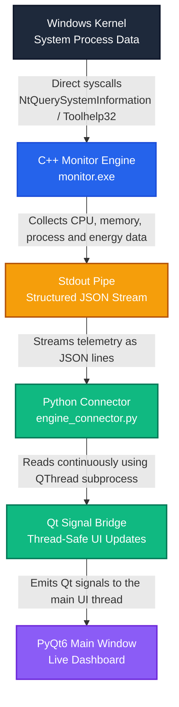
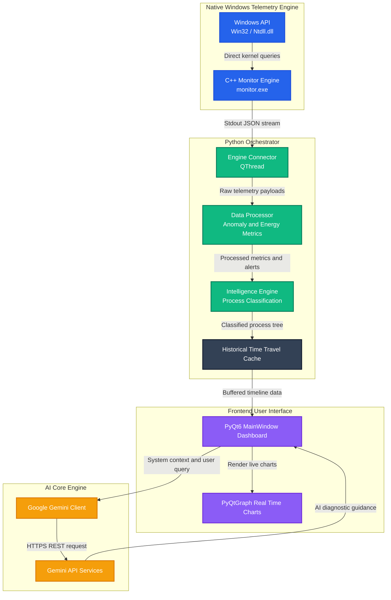

# ⚡ SystemHero
### Next-Generation Performance Analytics

**Enterprise-grade desktop system monitoring powered by native C++ telemetry and AI intelligence**

<br/>

[](https://python.org)
[](https://isocpp.org)
[](https://riverbankcomputing.com/software/pyqt/)
[](https://deepmind.google/technologies/gemini/)
[](https://microsoft.com/windows)
[](LICENSE)

<br/>


## 🎥 Full Video Demo

👉 **Watch here:** [Click to Watch Full Project Demo](https://www.linkedin.com/posts/krishna203ker_systemdesign-cplusplus-ai-ugcPost-7442235981371437057-f6_O/?utm_source=share&utm_medium=member_desktop&rcm=ACoAAE0Ost4BV_DpsL1V4XCailPUkdNw3mvSG8g)

<br/>

---

</div>

## 🌟 Introduction

**SystemHero** is a next-generation desktop system analyzer. Traditional task managers show dry numbers but don't explain *why* spikes happen, which processes are responsible, or *how* to fix them.

SystemHero fills this gap by coupling a **native C++ kernel telemetry engine** with an **AI intelligence backend** running Google Gemini, all wrapped in a hardware-accelerated, dark-themed PyQt6 dashboard.

> Traditional task managers show dry numbers. SystemHero explains the *story* behind them.

<br/>

---

## ✨ Features

### 🖥️ 1. Robust Real-Time Dashboard

A meticulously designed **4-zone scalable dashboard** delivering critical system information at a glance — without the clutter. Fully animated custom KPI indicators and PyQtGraph timelines provide a commercial-tier visual experience running at a smooth 60 FPS.


---

### 🤖 2. Intelligent AI Assistant

Ask system-level queries directly to the fine-tuned Gemini model. Receive automated recommendations, anomaly explanations, and health predictions using **live local environment context** — no cloud data ever leaves your machine.

<p align="center">
  <a href="YOUR_PROJECT_VIDEO_LINK_HERE" target="_blank">
    
  </a>
</p>

<p align="center">
<b>😂 Come see the chaos, enjoy the project, and drop an upvote, buddy!</b>
</p>

---

### 🧰 3. Core Capabilities Matrix

| Feature | Description |
| :--- | :--- |
| ⚡ **Real-Time Monitoring** | Tracks CPU load, RAM usage, Network I/O, and Disk activity with high-performance PyQtGraph visualizations. |
| 🧠 **Google Gemini Integration** | Built-in chat assistant providing deep system analysis, optimization suggestions, and answers using live context. |
| ⏪ **Time Travel UI** | Scrub through historical performance data from the dashboard to investigate exactly when and why a resource spike occurred. |
| 🎮 **Dynamic Hardware Profiles** | Seamlessly toggle between Gaming Mode (max power), Power Saving, and Work Mode from the settings engine. |
| 🔧 **Auto-Optimization** | Automatically detects resource-hogging background processes and safely limits or terminates them based on your thresholds. |

<br/>

---

## 💡 Why C++ Powers the Core

### The Problem with Pure Python

> [!IMPORTANT]
> High-frequency polling of hardware counters using Python interpreter libraries (like `psutil` or standard `ctypes`) creates a noticeable CPU footprint — meaning the **monitor itself consumes the resources it's trying to measure**, distorting telemetry accuracy.

### The C++ Solution

To ensure the monitoring engine runs with **near-zero overhead and sub-millisecond precision**, SystemHero implements a native C++ companion engine (`cpp_engine/monitor.cpp`):

| Advantage | Technical Detail |
| :--- | :--- |
| 🔩 **Direct Kernel Access** | Bypasses high-level wrappers; calls Windows OS kernel directly via `NtQuerySystemInformation` from `ntdll.dll` |
| 🏎️ **Zero GIL Constraints** | Compiled to native assembly — no Global Interpreter Lock, no bytecode translation overhead |
| 🪶 **Low-Memory Telemetry** | Queries the process table via `CreateToolhelp32Snapshot` and per-process memory via `GetProcessMemoryInfo` (`psapi.h`) |
| 📊 **Negligible Footprint** | Total CPU consumption stays **below 0.05%** during active monitoring |

<br/>

---

## 🏗️ System Architecture

SystemHero uses a **fully decoupled, multithreaded architecture**. The UI runs on the main thread; data capture, threat intelligence, and AI processing all run on dedicated `QThread` background threads — keeping the GUI responsive at all times.

### Data Flow Pipeline



### Full Architecture Diagram



### Component Responsibilities

| Component | Responsibility |
| :--- | :--- |
| `main.py` | Application entry point and thread orchestrator |
| `cpp_engine/monitor.cpp` | Native Windows telemetry — kernel-level CPU, RAM, process data |
| `backend/engine_connector.py` | QThread subprocess pipe reading the C++ stdout stream |
| `backend/data_processor.py` | Anomaly detection, energy profiling, metric normalization |
| `backend/intelligence_engine.py` | Process classification and threat scoring |
| `backend/cache.py` | Time-Travel historical data buffer |
| `ui/` | PyQt6 interfaces, custom widgets, and dashboard panels |

<br/>

---

## 🛠️ Technology Stack

| Technology | Category | Role in SystemHero | Why It Was Chosen |
| :--- | :--- | :--- | :--- |
| **C++ 17** | Native Systems | High-performance hardware telemetry (`monitor.cpp`) | Microsecond execution, direct Windows API access, zero interpreter overhead |
| **Python 3.10+** | Backend / Glue | Thread orchestrator, data pipelines, API wrapper | Fast AI tooling integration, rich library ecosystem, clean modular structure |
| **PyQt6** | GUI Framework | Main desktop application interface | Native GPU-accelerated rendering; lower memory footprint than Electron or web-based dashboards |
| **PyQtGraph** | Visualization | Live performance timelines and charts | Built specifically for real-time visualization at high frame rates using Qt Graphics View |
| **Google Gemini API** | Artificial Intelligence | System analysis assistant and health predictor | Analyzes live processes, recommends optimizations, and answers complex system queries |
| **psutil** | Diagnostics | Fallback metrics driver and auto-optimization | Reliable cross-platform telemetry source; handles process termination safely |

<br/>

---

## 🚀 End-to-End Execution Guide

### 1. Prerequisites

Before you begin, ensure you have the following installed:

- ✅ **Python 3.10+** — added to your system `PATH`
- ✅ **C++ Compiler** (choose one):
  - **Option A — MSVC:** `cl.exe` via Visual Studio Build Tools *(recommended)*
  - **Option B — GCC:** `g++` via MinGW, added to your environment `PATH`
- ✅ **Git** — to clone the repository

---

### 2. Clone & Set Up Python Environment

Open **PowerShell** or **Command Prompt** in your project directory:

```powershell
# Clone the repository
git clone https://github.com/your-username/SystemHero.git
cd SystemHero

# Create a virtual environment
python -m venv .venv

# Activate the virtual environment
.venv\Scripts\activate

# Install all Python dependencies
pip install -r requirements.txt
```

---

### 3. Compile the C++ Telemetry Engine

```powershell
# Navigate into the C++ engine folder
cd cpp_engine

# Run the build script
.\build.bat
```

> [!NOTE]
> `build.bat` automatically locates `cl.exe` (MSVC) or `g++` (GCC) and compiles `monitor.cpp` into the production-grade executable `monitor.exe` inside the `cpp_engine/` directory.

---

### 4. Configure the Gemini AI API Key

Create or open the `.env` file in the **project root** and add your key:

```env
GEMINI_API_KEY=your_actual_gemini_api_key_here
```

> Don't have a key yet? Get one free at [Google AI Studio →](https://aistudio.google.com/app/apikey)

---

### 5. Launch the Application

Return to the project root and start the dashboard:

```powershell
python main.py
```

*The PyQt6 GUI will open and immediately connect to the telemetry loop, feeding real-time analytics graphs, starting process diagnostics, and enabling the AI assistant.*

<br/>

---

## 📦 Deployment & Distribution

### Standalone Windows Executable

Package the entire application into a single portable `.exe` using **PyInstaller**:

```bash
# Install PyInstaller
pip install pyinstaller

# Build the standalone executable
pyinstaller --name "SystemHero" --windowed --onefile main.py
```

The final executable is output to the `/dist` directory, ready to distribute or deploy without requiring Python to be installed on the target machine.

<br/>

---

## 🗂️ Project Structure

```
SystemHero/
├── cpp_engine/
│   ├── monitor.cpp          # Native Windows kernel telemetry engine
│   ├── monitor.exe          # Compiled binary (generated by build.bat)
│   └── build.bat            # Cross-compiler build script (MSVC / GCC)
├── backend/
│   ├── engine_connector.py  # QThread subprocess pipe to C++ stdout
│   ├── data_processor.py    # Anomaly detection & energy profiling
│   ├── intelligence.py      # Process classification engine
│   └── cache.py             # Time-Travel historical data buffer
├── ui/
│   ├── main_window.py       # PyQt6 main dashboard
│   ├── widgets/             # Custom animated KPI & chart widgets
│   └── styles/              # QSS dark theme stylesheets
├── assets/
│   └── images/              # UI screenshots and banner
├── main.py                  # Application entry point
├── requirements.txt         # Python dependencies
├── .env                     # API key configuration (not committed)
└── README.md
```

<br/>

---

## 🤝 Contributing

Contributions, issues, and feature requests are welcome! Feel free to check the [issues page](../../issues).

1. Fork the project
2. Create your feature branch: `git checkout -b feature/AmazingFeature`
3. Commit your changes: `git commit -m 'Add some AmazingFeature'`
4. Push to the branch: `git push origin feature/AmazingFeature`
5. Open a Pull Request

<br/>

---

## 📄 License

Distributed under the **MIT License**. See [`LICENSE`](LICENSE) for more information.

<br/>

---

<div align="center">

**SystemHero** — Built with a rigorous focus on polished UI, modular code, and sub-millisecond data tracing.

<br/>

*If this project helped you, consider giving it a ⭐ on GitHub!*

</div>
