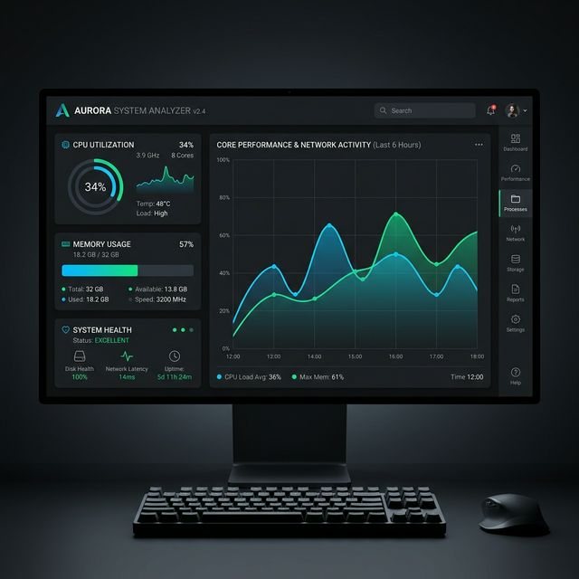
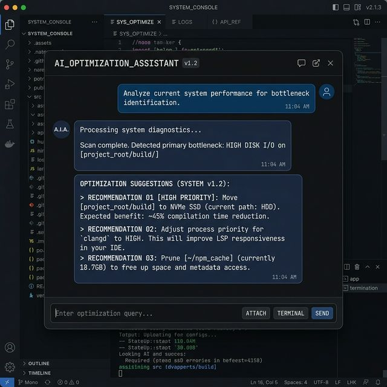
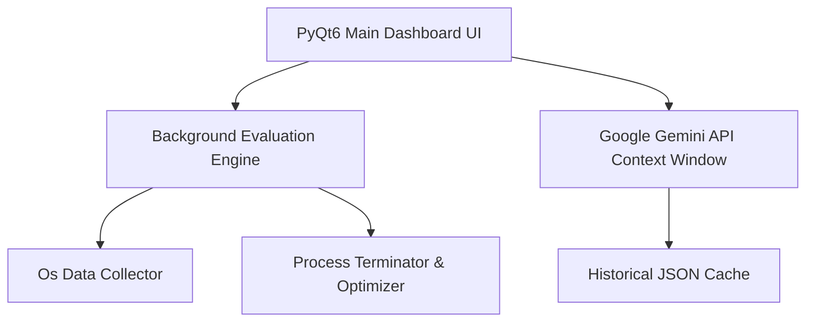

<div align="center">
  
  <br/>
  <h1>SystemHero: Next-Gen Performance Analytics</h1>
  <p><strong>Enterprise-grade desktop system monitoring with AI intelligence</strong></p>
</div>

<div align="center">
  <a href="#"></a>
  <a href="#"></a>
  <a href="#"></a>
  <a href="#"></a>
</div>

<br/>

## 🌟 Overview

**SystemHero** is a next-generation desktop application designed to provide comprehensive, intelligent monitoring of your system's performance. Evolving beyond traditional task managers, SystemHero integrates advanced real-time tracking (CPU, RAM, Disk, Network) with an AI-powered intelligence engine utilizing the Google Gemini API. 

The application offers a rich, heavily optimized dark-themed user interface built with PyQt6. With features ranging from process intelligence and auto-optimization to a unique "Time Travel" caching system that lets you review historical states, SystemHero brings proactive system health management directly to your workspace.

---

## ✨ Features In Action

### 1. Robust Dashboard UI
A meticulously designed 4-zone scalable dashboard delivering critical information instantly without the clutter. Fully animated custom KPI bounds and PyqtGraph timelines provide a commercial-tier visual aesthetic.

*(Insert your animated dashboard GIF below)*  
``

### 2. Intelligent AI Assistant
Ask system-level queries directly to our finely-tuned Gemini model. Receive automated recommendations and health predictions using real-time local environment context.

<div align="center">
  
</div>

### 3. Core Capabilities Matrix

| Feature | Description |
| :--- | :--- |
| **Real-Time Monitoring** | Tracks metrics like CPU load, RAM usage, Network I/O, and Disk activity in real time with high-performance visualizations using PyQtGraph. |
| **Google Gemini Integration** | Built-in chat assistant that provides deep system analysis, suggests optimizations, and answers any queries using real-time context. |
| **Time Travel UI** | Scrub through historical performance data seamlessly directly from the dashboard to investigate exactly when and why a resource spike occurred. |
| **Dynamic Hardware Profiles** | Seamlessly toggle between Gaming Mode (max power), Power Saving (background hunting), and Work Mode right from the settings engine. |
| **Auto-Optimization** | Automatically detects critical resource-hogging background processes and limits or safely terminates them to preserve system stability based on your thresholds. |

---

## 🚀 Getting Started

Follow these step-by-step instructions to set up and run the system analyzer locally.

### 1. Prerequisites
- **Python 3.9+** must be installed on your machine.
- A valid **Google Gemini API Key** (Set it in your environment or a `.env` file).

### 2. Setup Instructions

First, open your terminal (Command Prompt, PowerShell, or Git Bash):

```bash
# 1. Navigate to the project directory
cd newholisystemc++

# 2. Create a virtual environment to isolate dependencies
python -m venv .venv

# 3. Activate the virtual environment
# On Windows:
.venv\Scripts\activate
# On Mac/Linux:
source .venv/bin/activate

# 4. Install the required dependencies
pip install -r requirements.txt
```

### 3. Configuration

Before running the app, ensure you configure the AI module:
1. Open the `.env` file located in the project root.
2. Add your Gemini API key:
   ```env
   GEMINI_API_KEY=your_actual_api_key_here
   ```

### 4. Running the Application

Execute the main runner script inside the activated virtual environment:

```bash
python main.py
```
*The application UI will launch, and data collection will begin immediately within your secure local environment.*

---

## 🏗️ System Architecture

SystemHero relies on a heavily decoupled architecture bridging highly optimized frontend components with secure backend evaluation routines.



| Component | Responsibility |
| :--- | :--- |
| `main.py` | Application graphical entry point and thread orchestrator |
| `backend/` | Core logic, data processing, metrics collection |
| `ui/` | PyQt6 interfaces, customized widgets, and dash |
| `plugins/` | Sub-system for community plugins |

---

## 📦 Deployment & Distribution

### Option 1: Local Deployment (Standalone Executable)

Convert the Python architecture into a single runnable desktop application (`.exe`) via **PyInstaller** for native execution.

```bash
# 1. Install PyInstaller
pip install pyinstaller

# 2. Build the standalone executable
pyinstaller --name "SystemHero" --windowed --onefile main.py
```
*Your fast, native commercial executable will be dumped securely into the `/dist` directory.*

---
<div align="center">
  <i>Developed with a rigorous focus on polished UI, modular code, and sub-millisecond data tracing.</i>
</div>
